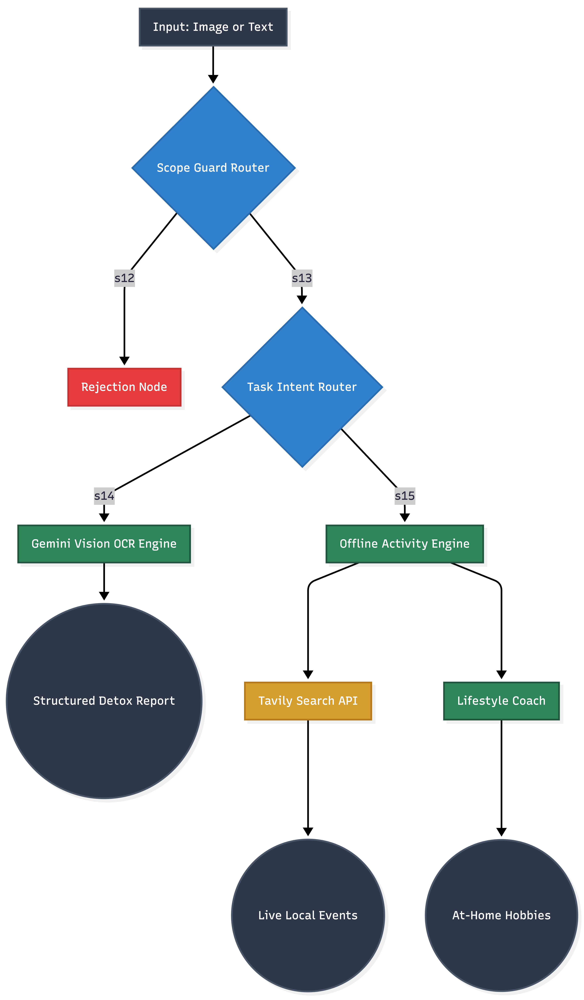

# 🌿 MindShift AI — Digital Well-Being & Habit Transformation Engine > **MindShift AI** is a dual-purpose Digital Well-Being assistant designed to analyze users' screen time and app usage habits, then guide them toward replacing lost digital hours with personalized, real-world offline alternatives (at-home hobbies, local live events, curated reading routines). --- ## 🎯 Project Purpose & Problem Statement Modern smartphones capture screen time metrics (iOS Screen Time / Android Digital Wellbeing) with high accuracy, but they rarely answer the critical question: **"How can I turn this lost time into something meaningful?"** As a result, users frequently get trapped in guilt-inducing doomscrolling loops. **MindShift AI addresses this challenge through two core missions:** 1. **In-Depth Habit Analysis:** Extract active usage durations and dominant apps from screenshots or text notes using an empathetic, guilt-free analytical voice. 2. **Alternative Habit Transformation:** Offer structured offline alternatives—ranging from quiet at-home resets (reading, cooking, DIY crafts) to real-time local outings (theater, concerts, exhibitions)—building a sustainable digital detox pathway. --- ## 🛠️ Why This Tech Stack? (Architectural Decisions) Rather than relying on a basic linear chatbot, this application is engineered around a **Hierarchical Multi-Agent Architecture**. Key technologies and their specific roles include: ### 1. 🦜🔗 LangGraph (Multi-Agent State Machine & Routing) * **Why it was chosen:** Linear prompt chains cannot reliably distinguish whether a user requires raw usage extraction or dynamic activity recommendations. * **Role in Project:** Serves as the core **State Machine**. It coordinates conditional routing across the `Scope Router` (guardrail enforcement), `Task Router` (intent classification), `Vision OCR Node` (media processing), and `Activity Node` (habit swaps) via dynamic state edges. ### 2. ⚡ LangChain Core (Orchestration & Data Flow) * **Why it was chosen:** Standardizes prompt template execution, output handling, and message history parsing across diverse LLM backends. * **Role in Project:** Manages conversational state across multi-turn interactions and normalizes multimodal payloads (base64 image strings) into structured schemas for downstream execution. ### 3. 🔍 Tavily AI (Real-Time Local Event Grounding) * **Why it was chosen:** Large Language Models (LLMs) rely on static training data and risk hallucinating venue names, dates, or ticket details for public events. * **Role in Project:** Queries live search APIs based on user location (e.g., Istanbul, London, Berlin) to retrieve verified real-time event data (concerts, theater, exhibitions, open-air cinema) and supply it directly into the generation pipeline. ### 4. 👁️ Google Gemini 3.6 Flash (Multimodal OCR & Reasoning) * **Why it was chosen:** High-throughput vision capability required for accurate Image-to-Text extraction from mobile dashboards. * **Role in Project:** Performs zero-shot OCR extraction on uploaded screenshots to identify precise active hours and top app durations without manual user input. --- ## 📐 System Architecture & Agent Flow

```


```

